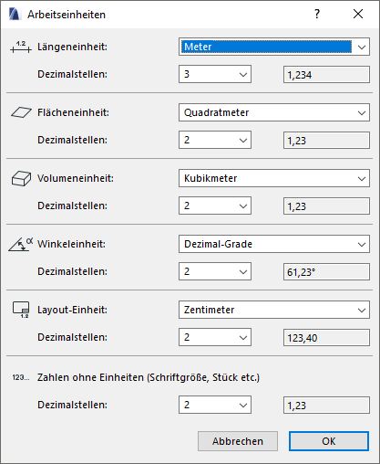
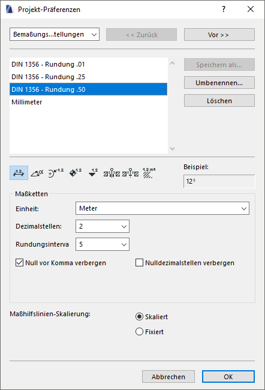
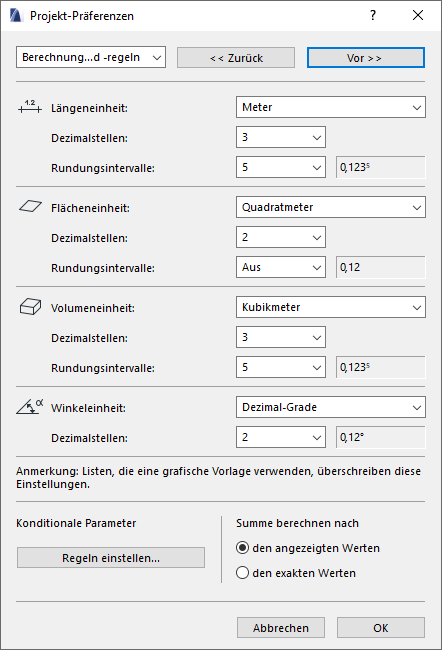

# Einheiten

Es kann manchmal etwas verwirrend sein, wo an welcher Stelle die zu verwendeten Einheiten eingestellt werden.
Hier ein kurzer Überblick:

Die _Arbeitseinheiten_ (<samp>Optionen > Projektpräferenzen > ~</samp>) regeln die Einheiten für die _Eingabe_, d.h. während des Modellierens in Tracker, Infoleiste, Objekteinstellungen usw.

In den _Bemaßungseinstellungen_ (die man auch im Grundriss durch die Schnell-Optionen-Leiste erreicht) wird festgelegt, wie die Einheiten und Maße erscheinen sollen, die im Modell selbst auftauchen. Dazu gehören z.B. alle Bemaßungen, aber auch das automatische Flächenmaß von Schraffuren, _**nicht**_ jedoch Etiketten.

In den _Berechnungseinstellungen_ lässt sich einstellen, wie die Maße in den Listen aussehen sollen. Ebenfalls betroffen sind die _Etiketten_.

