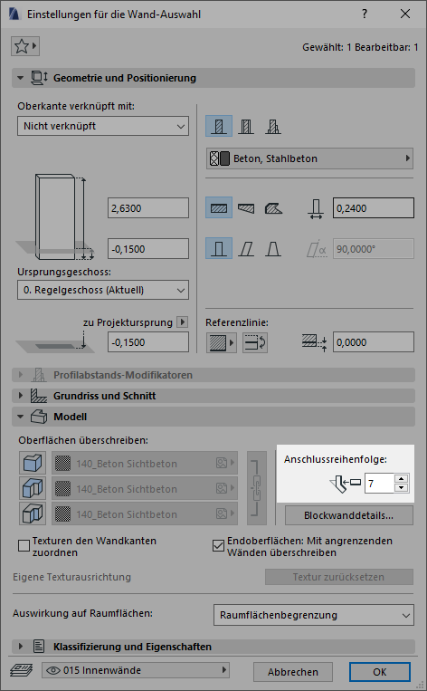
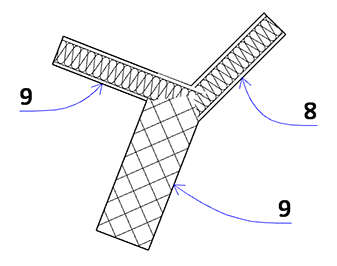
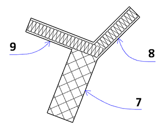

# Wände

Für Wand-Wand-Verbindungen reicht es nicht aus, dass sich die Wände berühren. Ihre Referenzlinien müssen sich schneiden bzw. treffen. Das Element bzw. die Schicht mit dem Baustoff der höheren Priorität schneidet das Element mit der niedrigeren Priorität.

## Anschlussreihenfolge
Die Anschlussreihenfolge ist ein Feature, dass wenig Aufmerksamkeit genießt, zumal es ein etwas abgeschiedenes Dasein fristet:

Jedoch lassen sich damit T/Y- und K-Verbindungen von Wänden meistens auflösen, ohne dass der ["Murray"](/techniken#stützen-zur-verschneidung) zum Einsatz kommen muss. Nun eine kleine Beispielsübersicht mit einer Stahlbetonwand und zwei GK-Wänden, die einem `Y` zusammentreffen. Etikettiert ist die jeweils gesetzte Anschlussreihenfolgenzahl.

Die Lage der blauen Referenzlinien: (Reinzeichnungsmodus ist _aus_, extra farbig hervorgehoben)

(Wenn alle drei Wände die selbe Anschlussreihenfolge haben, sieht das Bild übrigens gleich aus.)

