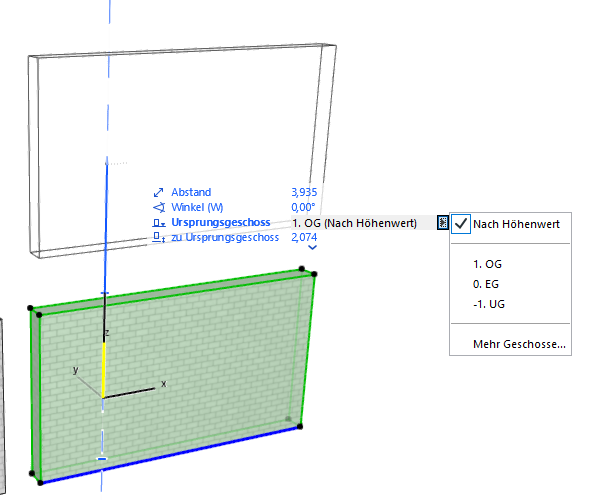
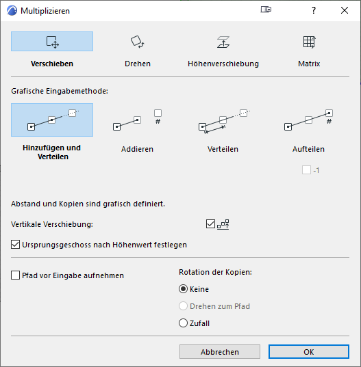
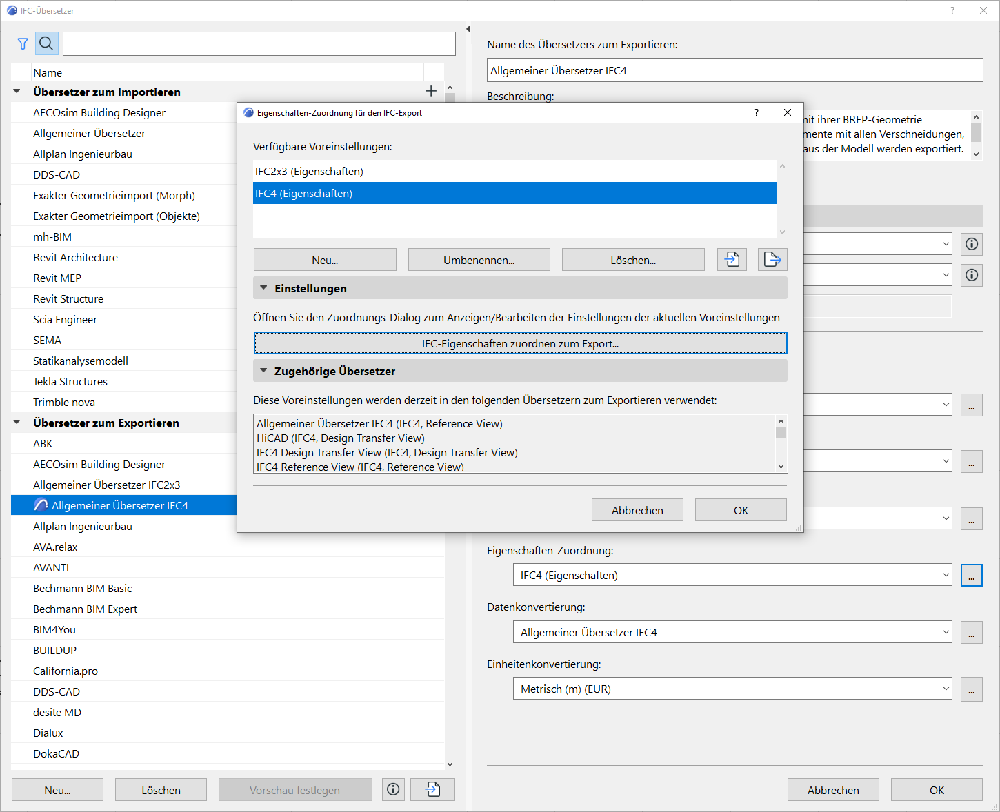
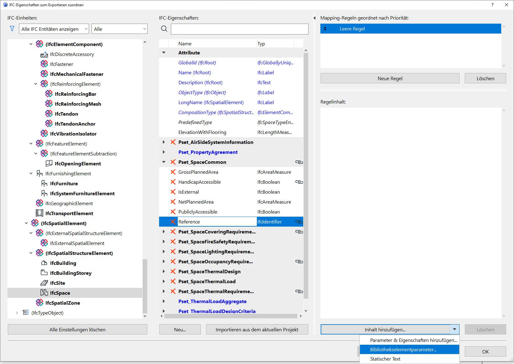
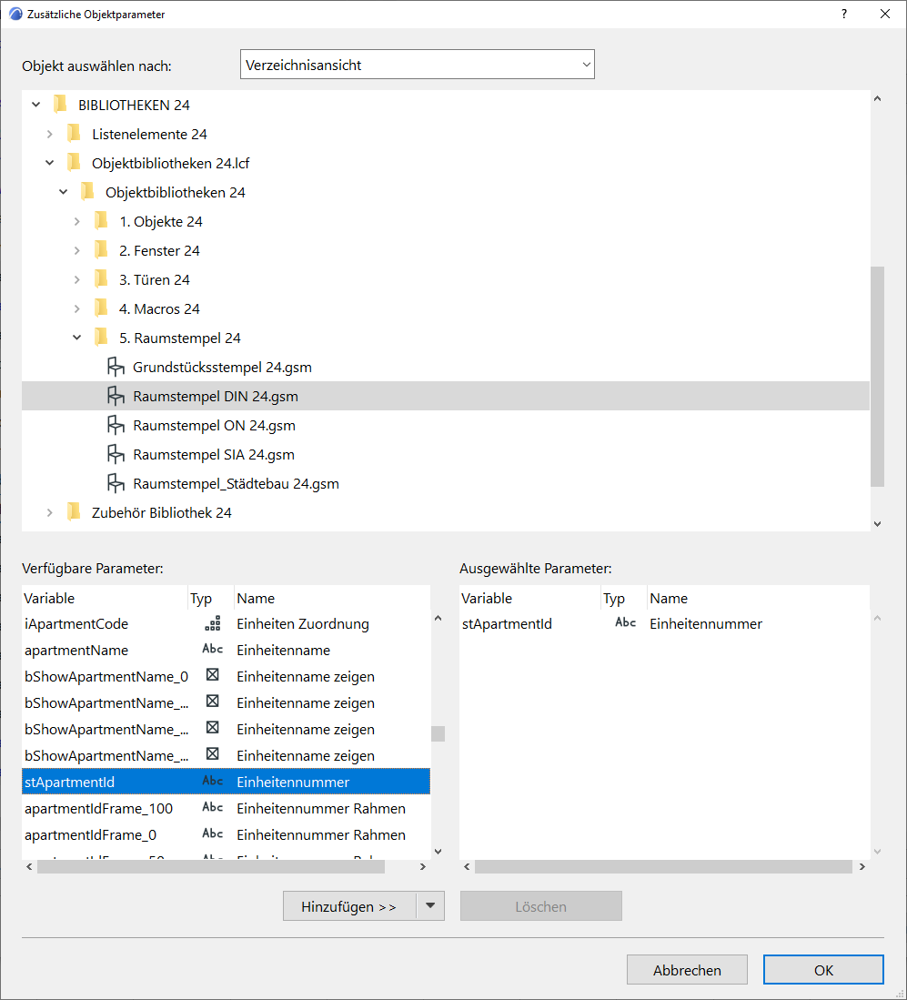
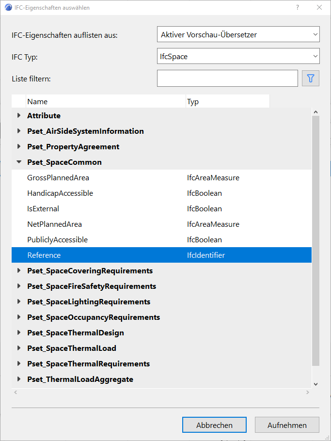

# Gesammelte Tipps und Tricks

### Schnelles Öffnen
Nicht selten braucht man mehrere Instanzen von Archicad offen. Hält man <kbd>Ctrl</kbd> gedrückt, wenn man über das Menü eine Datei öffnet, dann startet eine neue Archicad-Instanz im Hintergrund.

### Geschoss nach Höhenwert
Im 3D-Fenster können Elemente auch nach ihrem Höhenwert automatisch die Geschosszugehörigkeit wechseln. Dazu wählt man im Tracker die Option <samp>Nach Höhenwert</samp> aus:  
  

Dabei ist zu beachten, dass im <samp>Multiplizieren</samp> Dialog eine ähnliche Option vorhanden ist. Wird der entsprechende Haken gesetzt, ist anschließend auch im Tracker <samp>Nach Höhenwert</samp> gesetzt!  



### Autotexte verwenden
Archicad verwendet das Konzept von sogenannten Autotexten, das sind Schlüsselwörter in eckigen Klammern (ala `<AUTOTEXT>`). Archicad wertet diese aus und ersetzt dann an dieser Stelle diesen Text durch den entsprechenden hinterlegten Text.  
Diese Autotexte funktionieren auch in GDL Objekten und selbst in im Quelltext davon.  
Eine Auflistung aller möglichen Autotexte im [Helpcenter](https://helpcenter.graphisoft.com/de/user-guide/125474/). Die Autotexte lassen sich auch beim [Umbenennen](https://helpcenter.graphisoft.de/handbuecher/handbucher-zu-archicad-22/hilfe-zu-archicad-22/dokumentation/publizieren/publisher/) von Publisher-Elementen verwenden; einige spezielle Autotexte sind dort direkt verfügbar, alle anderen können aber trotzdem eingegeben werden.


### Favoriten
Sind mal wieder Einstellungen und Attribute von einem Element auf ein anderes zu übertragen, so geht das fix mit Pipette und Spritze. Was aber, wenn man nicht das nicht für ein oder zwei Objekte macht, sondern für 300? Der Trick ist, sich einen temporären _Favoriten_ zu erstellen, den man nach dem anwenden auf alle Elemente wieder löschen kann.


### Kollisionserkennung
Die Kollisionserkennung in Archicad kann helfen frühzeitig und automatisch Problemen auf die Spur zu kommen. Dabei gibt es jedoch folgendes zu beachten: Archicad kann nicht wissen, bei welchen Verschneidungen es sich um gewollte oder ungewollte handelt. Da weiterhin "stärkere" Baustoffe durch "schwächere" schneiden, werden diese Stellen [nicht erkannt](https://archicad-talk.graphisoft.com/viewtopic.php?f=20&t=69024). Es kann helfen, vor der Kollisionserkennung die Ebenenverschneidungszahl der zu untersuchenden Elemente auf `0` zu stellen.


### Letzten Befehl wiederholen
Wer viel mit anderen CAD-Systemen arbeitet, vermisst vielleicht die Möglichkeit den _letzten Befehl_ zu wiederholen. Tatsächlich bietet sich auch in Archicad diese Möglichkeit. Man kann dem gleichnamigen Befehl einen Keyboardshortcut zuweisen. 


### Linienzeichnung auch im 3D
Wir alle wissen, dass 2D Linien nie im 3D zu sehen sind. Als Alternative bieten sich Morphlinien an, allerdings ist es zu aufwendig eine schon vorhandene Zeichnung damit nachzuzeichnen. Stattdessen kann man die Zeichnung als DWG abspeichern und dann über <samp>'Datei > Interoperabilität > Dazuladen'</samp> mit der Option <samp>'Inhalt des Modellbereichs als GDL Objekt importieren'</samp> re-importieren. Nun ist die Zeichnung auch im 3D sichtbar.


### Element ID Manager
Die Einstellungen des _Element ID Managers_ (gut versteckt unter "<samp>Dokumentation > Listen & Berechnungen > ~</samp>) können gespeichert werden und auf anderen Rechnern wiederverwendet werden: [<sup>Quelle</sup>](https://archicad-talk.graphisoft.com/viewtopic.php?f=34&t=69156)  
Beim Speichern der Einstellungen <samp>Set bearbeiten > Speichern als…</samp> wird ein Ordner namens <samp>EIDM Einstellungen ACVersionnr.Buildnr</samp> innerhalb von
```
C:\Users\<UserProfileName>\AppData\Roaming\GRAPHISOFT   #win
~/Library/Preferences/GRAPHISOFT/                       #mac
```
erzeugt. Die Datei `EIDM Einstellungen.bin` da drin einfach kopieren und auf einen anderen Rechner in den entsprechenden Ordner übertragen.


### Nach Elementparametern suchen
Im Gegensatz zu der Interaktiven Auswertung kann bei <samp>Suchen & Aktivieren</samp> nicht nach Bibliothekselementparametern gesucht werden. Es gibt jedoch einen Umweg über die IFC Sachmerkmale. Im folgenden am Beispiel der Einheitennummer von Räumen illustriert.

Zunächst müssen wir über <samp>Ablage > Interoperabilität > IFC</samp> den <samp>IFC Übersetzer</samp> öffnen. Dort wählen wir den "Allgemeinen Übersetzer" (markiert mit Archicadlogo) aus, legen ihn als Vorschau fest (falls nicht ohnehin ausgewählt) und gehen dann rechts über die drei Punkte zur Eigenschaftenzuordnung.   
Anschließend <samp>IFC-Eigenschaften zuordnen zum Export…</samp>.  



In unserem Beispiel navigieren wir im IFC-Tree zu <samp>IfcSpace</samp>. Im Property Set <samp>SpaceCommon</samp> gibt es bereits einen IfcIdentifier namens `Reference`, den wir für unseren Zweck verwenden können. Natürlich ließe sich auch eine neue IFC–Eigenschaft anlegen. Rechts erstellen wir zunächst eine neue Mapping-Regel, welcher wir über das Dreieck den gewünschen <samp>Bibliothekselementparameter</samp> zuweisen können. Nachdem wir das entsprechende Objekt (hier `Raumstempel DIN xx.gsm`) lokalisiert haben, fügen wir den entsprechenden Parameter `stApartmentId` hinzu. Alles mit OK bestätigen.  
  



Nun lässt sich bei <samp>Suchen & Aktivieren</samp> unter <samp>IFC-Eigenschaften</samp> nach der Einheitennummer suchen.  



### Schriftarten in Interaktiven Auswertung
Um Schriftarten in einer IA schnell zu ändern, lässt sich die Auswertung als XML Datei exportieren. Anschließend kann die gewünschte Schriftart eingetauscht werden:  
```xml
<Font_Type>Arial Westlich</Font_Type>
```
[<sup>Quelle</sup>](https://archicad-talk.graphisoft.com/viewtopic.php?p=314694#p314694)


### Offscreen Paletten
Besonders wenn man mit Laptop + einem externen Bildschirm arbeitet, kann es passieren, dass unterwegs (ohne zweiten Bildschirm) manche Paletten zu fehlen scheinen und sich auch nicht "wiederbeleben" lassen.  
Eine Lösung dafür ist [hier dokumentiert](https://lucasbecker.de/posts/how-to-get-back-missing-archicad-palettes).  
Tipp: Für solche Umstände zwei Arbeitsumgebungen pflegen!


### Schraffuren und ihre Art
Schraffuren existieren in mehreren Kategorien. Zwei fallen dabei besonders auf, denn der Unterschied ist nicht besonders klar: Vektorschraffuren und Symbolschraffuren. Nur letztere kann der User völlig frei selbst erstellen.  
Der Unterschied wird aber beim Export deutlich. Im **PDF** werden Symbolschraffuren ebenfalls als Schraffur gespeichert – Vektorschraffuren dagegen werden in Einzellinien zerlegt. (Das bedeutet auch, dass sich Symbolschraffuren z.B. in Illustrator sehr viel leichter bearbeiten lassen.)  
Im **DWG** dagegen ist es umgekehrt. Dort kommen die Vektorschraffuren als native AutoCAD-Schraffuren an.  
Der Unterschied in der Dateigröße kann merklich sein und teils bis zu Faktor 10 betragen. Es kann sich daher lohnen, nur Symbolschraffuren zu verwenden, sodass man kleinere PDFs erzeugen kann, sowie gleichzeitig eine Mapping Tabelle für die Schraffuren im DWG-Export zu erstellen, dass auch in AutoCAD die Schraffuren noch als solche ankommen.


### Nickeligkeiten
Bei den Sichtmarkern (also Markern, die eine Sicht erstellen) gibt es die Möglichkeit die Bildschirmdarstellung der nicht druckbaren Lienen (wie Ansichtstiefe) durch die globale Vergabe eines Stiftes zu verändern, in der Arbeitsumgebung zu finden unter den "Bildschirm-Optionen". 
Diese Darstellung scheint bei eingeschalteter "Echter Linienstärke" nun aber nicht zu stimmen. Das liegt an einer irren Wechselwirkung: 
Die Stärke wird in Schnitten/Ansichten durch Stift Nr. 1 und bei Innenansichten durch Stift Nr. 85. bestimmt.  
[<sup>Quelle</sup>](https://community.graphisoft.com/t5/Documentation/Marker-Elements-on-screen-only-parts/m-p/570733/highlight/true#M61935)


### Codemeter Lizenzserver
[David Kehr](https://www.davidkehr.com/raspberry-pi-linux-als-codemeter-lizenzserver/) beschreibt in diesem Artikel, wie man einen Raspberry Pi als Dongleserver verwendet.


### Rien ne va plus
Nichts geht mehr? Um Archicad komplett zurückzusetzen ist ein Registry Cleaner auf Nachfrage beim Support, bzw. bei der [IDC](https://www.idc.ch/nc/support/view/?tx_idcsupport%5BprimaryLink%5D=1027&tx_idcsupport%5Bentry%5D=591&cHash=4551039ff4a5def9ae3ec33d61887915) erhältlich. 
<!-- archive.org link:: http://web.archive.org/web/20211013130329/https://www.idc.ch/nc/support/view/?tx_idcsupport%5BprimaryLink%5D=1027&tx_idcsupport%5Bentry%5D=591&cHash=4551039ff4a5def9ae3ec33d61887915 -->
