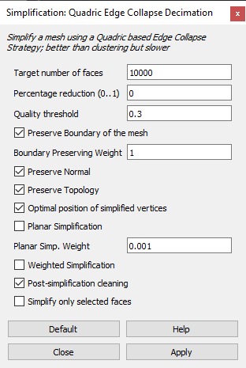

# Workflows mit verschiedenen Dateiformaten

## Import

**Folgende Formate sind direkt importierbar:**  
(Entweder über Drag&Drop oder über Ablage > Interoperabilität > Dazuladen…)  
mod, 2dl, emf, wmf, dwf, [dwg](#dwg), HPGL (.plt), IFC, skp, [kmz](#kmz) (Google Earth), [3dm](#3dm), [dae](#dae) (Collada), [stl](#stl)  
[Vollständige Auflistung](https://helpcenter.graphisoft.com/knowledgebase/25765/)

Protip: [Online 3DViewer](https://3dviewer.net/)

### DWG
Direkt in Archicad importierbar.  
DWG und [DXF](#dxf) können auch als XREFs eingesetzt werden.  
Mit der Funktion "In 2D Elemente zerlegen" können DWG und DXF direkt im Grundriss in native Modellelemente (Linien, Bögen, Schraffuren) umgewandelt werden. Dabei ist jedoch auf _"Attribute Pollution"_ zu achten! Es ist schnell passiert, dass ungewollte Attribute, wie Linientypen und Schraffuren, ihren Weg in die Archicaddatei finden. Unter Umständen also lieber in einer neuen Datei zerlegen und dort bereinigen.  
Aufgemerkt bei DWGs mit **3D-Inhalt**! Bei diesem Typus kommt es sehr auf die Art des Inhalts an: Normale Blöcke lassen sich _als GDL importieren_, AEC- und Multiviewblöcke jedoch nicht. Das liegt daran, dass AutoCAD Architecture DWGs ein eigenes Format sind. Bei diesen Dateien muss man in AutoCAD Architecture zunächst nach AutoCAD (sic!) exportieren.

### DXF
Direkt in Archicad importierbar. Siehe auch [DWG](#dwg).

### PDF
Archicad kann PDFs im Grundriss platzieren, und auch in seine Einzelteile zerlegen (sofern vektorbasiert). Das ist vor allem bei z.B. Herstellerdetails nützlich.  
Es sollte der Archicad-Maßstab vor dem Import beachtet werden. Dieser muss vor dem Einfügen der PDF-Zeichnung dem Maßstab letzterer entsprechen. So ist keine anschließende Skalierung nötig.

### DAE
Collada Dateien sind direkt in Archicad importierbar. Dabei wird ein _Objekt_ erzeugt.
Auch der Export zu Collada funktioniert sehr gut und stellt ein solides Austauschformat für Geometrie dar (z.B. nach Blender).

### STL
Stereolithographie Dateien lassen sich direkt in Archicad importieren. Dabei wird ein _Morph_ erzeugt.  
Oft sind zu importierende Meshes jedoch sehr komplex, wodurch diese Methode u.U. nicht empfehlenswert ist; stattdessen sollte lieber eine [DAE](#dae) verwendet werden.

### 3dm
[Rhino](https://rhino3d.com/) Dateien können seit Archicad 20 nativ (ohne Plugin) importiert und exportiert werden.
[Siehe auch](https://helpcenter.graphisoft.com/knowledgebase/44321/)

### SHP
Shape Files sind das beliebteste Dateiformat von GIS Anwendungen um 2D Inhalte abzubilden. Kann durch Archicad nicht direkt gelesen werden. 2 mögliche Wege:
- Zunächst in [QGis](https://qgis.org/) importieren, dort bei Bedarf _reprojizieren_, dann als [DXF](#dxf) exportieren, oder...
- Import über Rhino in Grasshopper (entweder durch integrierten Importer, der jedoch etwas 'picky' ist, oder über ein Plugin, wie [ShrimpGIS](https://github.com/AntonelloDN/ShrimpGIS)), dann dort Export als DWG/DXF)  

Shape Files bestehen eigentlich aus 3–4 Dateien: `.shp` (enthält die eigentliche Geometrie), `.dbf` (Attribute als dBase), `.shx` (Indexdatei), und bisweilen eine `.prj` Datei, in der Projektionsinformationen enthalten sind.
Shapefiles haben eine Größenbeschränkung von 2 GB. Als Ersatz kommt auch oft [GeoPackage](#geopackage) zum Einsatz.

Aufpassen muss man bezüglich der verwendeten Koordinatensysteme; siehe dazu auch diese [Webseite](https://ihatecoordinatesystems.com/).

### GeoJSON
Ähnlich wie [SHP](#shp) ist [GeoJSON](https://geojson.org/) ein allgemeines Format, um geographische Strukturen zweidimensional abzubilden.  
Kann in [QGis](https://qgis.org/) importiert und von dort in eine [DXF](#dxf) exportiert werden. Eine Vorschau im Browser ist auf [Kepler.gl](https://kepler.gl/demo) möglich.

### GeoPackage
GeoPackage `.gpkg` ist ein Ersatz für [Shape Files](#shp) ohne Einschränkungen. Darin sind alle nötigen Informationen in einer einzigen Datei zusammengefasst.  
Kann in [QGis](https://qgis.org/) importiert und von dort in eine [DXF](#dxf) exportiert werden.

### City GML
Normierte 3D Darstellung von GIS Anwendungen, und oft auch bei offiziellen Stellen (wie Landesvermessungsämtern) zu bekommen.  
Umwandlung mittels des [FZKViewers](https://www.iai.kit.edu/1302.php) des Karlsruher Instituts für Technologe (KIT) in [STL](#stl) oder IFC.

### e57
Archicad kann e57 Punktwolken einlesen (wenn auch mit einigen Einschränkungen; u.a. wird eine spezielle LCF beim Import generiert, die Darstellung ist also mit GDL begrenzt manipulierbar), allerdings ist es sehr empfehlenswert große Punktwolken mit [CloudCompare](https://www.danielgm.net/cc/) auszudünnen – zur Erhaltung von Nerven und Rechenleistung.  
Eine Alternative ist die Verwendung eines [Plugins](https://bimm-gmbh.de/portfolio/bimmtool/), welches die Handhabung direkt in Archicad erleichtert und aufgemessene Punkte in native Elemente umwandeln kann.  
Das kostenlose [BIMcollab ZOOM](https://support.bimcollab.com/en/zoom/free-ifc-viewer) kann neben IFC auch e57 einlesen und referenzieren.  
Obacht bei Punktwolken mit Scalar Fields: Archicad kann nur die RBG Werte darstellen. Werden Punktwolken ohne entsprechende Echtfarbwerte importiert, werden die Punktwolken trotz möglichem Scalar Field nur in schwarz angezeigt. Um tsrotzdem an die gewünschte Darstellung zu kommen, kann vorher mit [CloudCompare](https://www.cloudcompare.org/doc/wiki/index.php?title=Scalar_fields%5CConvert_to_RGB) das Scalar Field in RGB umgewandelt werden.

### Andere Punktwolken
Andere Formate als `e57` sind mit [CloudCompare](https://www.danielgm.net/cc/) zu konvertieren. Manche allerdings, wie `LGS` von Leica, sind Hersteller-spezifisch und können – ein klassisches 'Lock-In' Manöver – nur mit spezieller Software bearbeitet werden.

### XYZ
Archicad kann xyz Dateien automatisch in Freiflächen übersetzen: "Ablage > Interoperabililtät > Freifläche aus Vermesser-Daten erstellen".  
Ob die Daten im Gauß-Krüger- oder im UTM-Koordinatensystem vorliegen, dürfte im Alltag bei geringen Gebäudeabmessungen vernachlässigbar sein, allerdings ist darauf hinzuweisen, dass die Koordinaten eine Abweichung von ~4cm auf 100 Meter zueinander besitzen.[1](https://www.lgln.niedersachsen.de/startseite/online_angebote_amp_services/hilfe_amp_support/frequently_asked_questions_faq/was-unterscheidet-die-gau-krueger-abbildung-von-der-utm-abbildung-51596.html), [2](https://www.kreis-paderborn.de/kreis_paderborn/buergerservice/lebenslagen/dienstleistungen/62-utm-koordinaten.php)  
Weiterhin wurde in Deutschland im Zuge der europäischen Harmonisierung vor einigen Jahren damit begonnen, sämtliche Daten der öffentlichen Hand in UTM (ETRS89) umzuwandeln. Damit haben die UTM-Koordinaten offiziellen Charakter, und Eingaben im GK-System werden i.d.R. von den Ämtern nicht mehr akzeptiert.  
Eine online Koordinatenumrechung gibt es z.B. [hier](https://www.koordinaten-umrechner.de/). Die meisten Ämter stellen aber Stützpunkte zur Verfügung, über die mithilfe eines Transformationsprogramms die Daten präzise umgerechnet werden können.

Details XYZ …

Die Datei muss aus drei Spalten bestehen, und es dürfen nur numerische Eingaben vorkommen. Sollte Text gefunden werden, wird die Zeile automatisch als Kommentar gewertet und übersprungen. Es darf am Anfang eine numerische ID vorangestellt sein (ergibt dann 1+3 Spalten). Zwischen den einzelnen Spalten ist ein Seperator einzusetzen, dessen konsistente Verwendung essentiell ist. Der Seperator ist wahlweise ein Leerzeichen, ein Tabulator oder ein Semikolon. Kommata und Punkte werden auch akzeptiert, man sollte aber darauf verzichten diese zu verwenden, da es zu leicht mit dem Dezimaltrenner verwechselt werden kann. Werden diese Regeln nicht eingehalten, so quittiert Archicad das mit einer Fehlermeldung.

### FBX
Weit verbreitetes, aber proprietäres Austauschformat für 3D Inhalte.  
Muss in ein anderes Format umgewandelt werden, z.B. mittels dem kostenfreien [Autodesk FBX Converter](https://www.autodesk.com/developer-network/platform-technologies/fbx-converter-archives).  
Alternativ gibt es mit [Modelport](https://archvista.com/modelport/) ein sehr potentes Plugin für Archicad.

### 3DS
Dateiformat von Autodesk 3ds Max, kann nicht über "Dazuladen" importiert werden, sondern hat stattdessen einen eigenen Dialog unter "Interoperabilität".
Erstellt ein _Objekt_. Allerdings werden dabei _keine_ Solids erstellt (Schnittdarstellungen werden ev. nicht wie erhofft aussehen).  
Kann vorher mit [Meshlab](#meshlab), wenn gewünscht, vereinfacht werden.

### KMZ
KMZ Dateien sind komprimierte `.kml` Dateien. KML (_"Keyhole Markup Language"_) ist ein XML-basiertes Format, das Punkte, Linien, Polygone, sowie mit der Geometrie verbundene Attribute unterstützt. Bekannt ist das Format vor allem durch die Verwendung in Google Earth. [°](http://justsolve.archiveteam.org/wiki/KML)

### MAX
Das native Dateiformat von 3ds Max `.max` kann nur von 3ds Max selbst gelesen werden. Selbst alle mir bekannten Konvertierer benötigen ein installiertes 3ds auf dem Rechner.

### OBJ
Die obj-Datei in [Meshlab](#meshlab) importieren und als [STL](#stl) oder als [DAE](#dae) abspeichern: "File > Export Mesh as…"

### RFA
Revit Families (`.rfa`) und Revit Dateien (`.rvt`) können zumindest ihrer Geometrie habhaft gemacht werden.  
Bis Archicad 24 mit dem [Plugin von Bim6x](https://bim6x.com/store). ([Helpcenter Artikel](https://helpcenter.graphisoft.com/knowledgebase/85861/))  
Ab Archicad 25 ist das [nativ möglich](https://helpcenter.graphisoft.com/user-guide/136661/#XREF_34859_Native_to_ARCHICAD). Revit Modelle können nun auch gehotlinkt werden; MEP Families werden korrekt übernommen und sind mit dem MEP Modeler verknüpfbar.

### RVT
Siehe [RFA](#rfa)

### SAF
Neu hinzugekommen in Archicad 24 ist das `Structural Analysis Format`, oder kurz [SAF](http://saf.guide/) – tatsächlich aber handelt es sich um gar kein eigenes Dateiformat, sondern ist eine Excel Datei.

---

## Export
### Tipps zum DWG-Export
- Ein einfacher Weg für die [Ebenenkonvertierung](https://www.davidkehr.com/ebenenkonvertierung-in-archicad/).
- Anpassung von [Linienarten](https://helpcenter.graphisoft.com/knowledgebase/25749/) an Autocad

## BEM
Über die Energiemodellbewertung kann [**Green Building XML (gbXML)**](https://gbxml.org/) und **PHPP** exportiert werden.  
Siehe auch [GS Community Guide](https://community.graphisoft.com/t5/Data-Exchange-articles/How-to-prepare-the-BIM-model-for-the-Energy-Evaluation/ta-p/303534) und [AC-Hilfe](https://help.graphisoft.com/AC/25/ger/_AC25_Help/110_EnergyEvaluation/110_EnergyEvaluation-1.htm).

---

## Meshlab
[Meshlab](http://www.meshlab.net/) herunterladen, falls man es noch nicht auf dem Rechner hat.
Sollte Meshlab beim Import von Dateien in einem "<samp>Post-Open Processing</samp>" Dialog fragen: "<samp>Unify Duplicated Vertices?</samp>", so ist dies zu bejahen.

Die Oberfläche und die Termini sind gewöhnungsbedürftig, darum kurz eine Erläuterung:

Um stark facettierte Objekte zu entschärfen wählt man:  
"<samp>Filter > Remeshing, Simplification and Reconstruction > Simplification: Quadric Edge Collapse Decimation</samp>".

Dort kann man dann die <samp>Target number of faces</samp> langsam herunterdrehen – "Apply" drücken nicht vergessen. Je nach Komplexität sollte man versuchen am Ende mindestens unter 10'000 Faces zu kommen. Wichtig: "<samp>Preserve Boundary of the mesh</samp>" sollte angehakt sein, damit das Element nicht "schrumpft". "<samp>Preserve Topology</samp>" kann ebenfalls zu besseren Ergebnissen führen.

Je nachdem, wo das Objekt ursprünglich herkam, sind die Achsen "verdreht" – es gibt leider keine einheitliche Konvention. Um sicher zu gehen hilft:  
"<samp>Render > Show Axis</samp>"

Sollte das Ergebnis nicht den Erwartungen entsprechen, verwendet man
"<samp>Filters > Normals, Curvature and Orientation > Transform: Rotate</samp>". Der Befehlt hat netterweise eine Vorschau.

Der kombinierte Befehl "<samp>Filters > Normals, Curvature and Orientation > Transform: Translate, Center, set Origin</samp>" hilft schlussendlich das Objekt auf den Ursprung zu setzen, was den Import in Archicad erleichtert. Als "<samp>Transfomation</samp>" "<samp>Center on Scene BBox</samp>".

