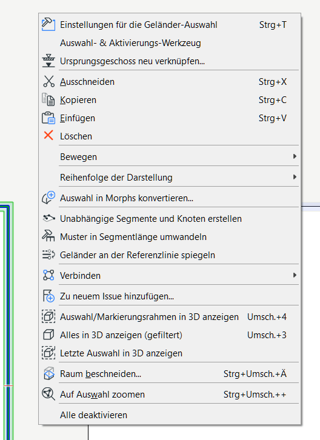
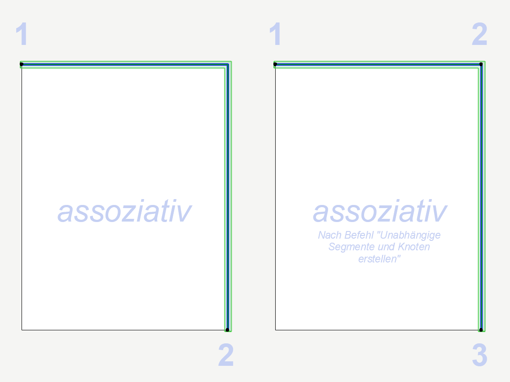

# Geländer

#### Geländersegmente und Muster
Der Befehl **`Unabhängige Segmente und Knoten erstellen`** bezieht sich auf die Segmente und Knoten der Geländerreferenzlinie. Nehmen wir uns eine simple Decke, an der wir ein Geländer assoziativ anheften: Ausgehend von der oberen linken Ecke zur unteren rechten Ecke. In diesem Fall haben wir zwei Knoten definiert, Archicad hat zwei Segmente und einen Zwischenknoten erzeugt. Dieser wurde automatisch erzeugt, weil Archicad dem Umriss der Decke folgt und an einem Plattenknoten eben auch einen Geländerknoten (mit Pfosten) erstellt. In diesem Fall (und nur dann) ist der Befehl `Unabhängige Segmente und Knoten erstellen` im Kontextmenü verfügbar. Zwischenknoten sind daran zu erkennen, dass keine Hotspots vorhanden sind. Benutzerdefinierte Knoten haben immer Hotspots.
Wenn man den Befehl also ausführt, werden die automatisch erstellten Zwischenknoten in reguläre Knoten umgewandelt (so als ob der User diese eingegeben hätte), welche auch Hotspots besitzen.

 

Manchmal erscheint es so, als ob man das **Muster** in jedem Segment anpassen kann, manchmal dagegen ändert eine Anpassung des Musters alle Segmente. Um die Segmente unabhängig von einander in ihrem Muster anzupassen gibt es den Befehl `Muster in Segmentlänge umwandeln` (über das Kontextmenü). Zugegeben eine etwas kryptische Beschreibung…

<iframe width="640" height="360" src="https://www.youtube.com/embed/DZHVAk5z0uU" frameborder="0" allow="accelerometer; autoplay; encrypted-media; gyroscope; picture-in-picture" allowfullscreen></iframe>

#### Pfostenmuster editieren
<iframe width="640" height="360" src="https://www.youtube.com/embed/3NoWIzePwYI" frameborder="0" allow="accelerometer; autoplay; encrypted-media; gyroscope; picture-in-picture" allowfullscreen></iframe>

#### Geländer Endstücke
<iframe width="640" height="360" src="https://www.youtube.com/embed/gwAoXXxJVWc" frameborder="0" allow="accelerometer; autoplay; encrypted-media; gyroscope; picture-in-picture" allowfullscreen></iframe>
