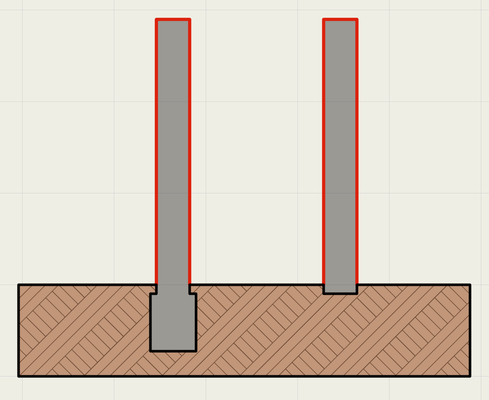
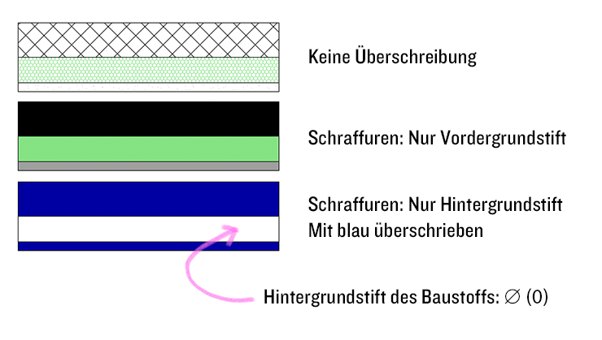

# Grafische Überschreibug (GÜ)

## Decken
Deckenschraffuren können nur überschrieben werden, wenn mindestens der _Hintergrund_ angestellt ist. Das bedeutet: In der Grundeinstellung _Hintergrundschraffur_ an, und ggf. in der Standarddarstellung der GÜ auf <samp>nicht sichtbar</samp> überschreiben. 

## Elementkonturen verschwinden
Angenommen man möchte alle geschnittenen Bauelemente einheitlich grau einfärben. Entfernt man in der GÜ den Haken für Schichttrennlinien, verschwinden nun jedoch plötzlich die Konturen des Elements zur Freifläche. Das ist eine [aktuelle Limitierung](https://archicad-talk.graphisoft.com/viewtopic.php?p=312431#p312431) des Systems: Es werden nur die _dickeren_ von übereinanderliegenden Linien im Schnitt behalten. Durch die GÜ wird jedoch genau diese Konturlinie gelöscht.
Der Workaround (siehe Bild) ist, der Freifläche in ihren Einstellungen einen dickeren Konturstift als der Wand zu geben. So verschwinden die Konturen nicht mehr, allerdings werden sie in der Farbe der Freifläche angezeigt.

## Nur den Kern überschreiben
Einzelne Schichten zu überschreiben geht bislang noch nicht. Allerdings lässt sich das dennoch mit geschickter Zuordnung der Stifte zu den Baustoffen und klugen Stiftsets dennnoch teilweise anstellen. Gut zu sehen ist hier auch das "Feature", dass Hintergrundstifte, die auf `0` (null = transparent) gesetzt sind, sich **nicht** überschreiben lassen.

