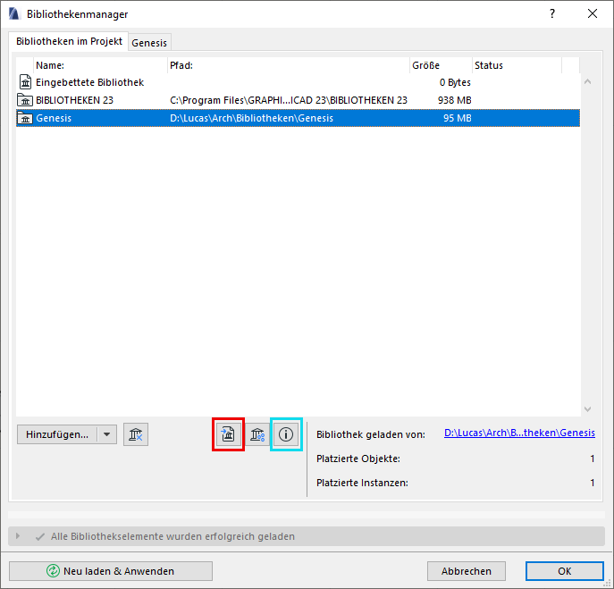
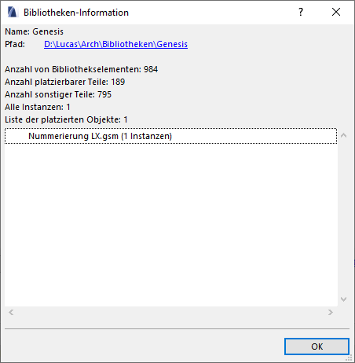
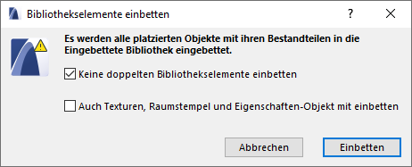

# Bibliotheken und Objekte

## Bibliothekeninformation
Unter anderem lassen sich im Bibliothekenmanager die Anzahl der Elemente (inkl. nicht platzierbare Objekte wie Makros, Fensterstempel usw.), die Anzahl platzierbarer Elemente und eine detaillierte Liste (Namen und Anzahl) der platzierten Objekte anzeigen.
Die Detailinfos gibts mittels des cyan gerahmten Buttons:

## Migration von Objekten
Die Migration eines Objekts basiert auf seiner GUID.  
Wenn das 'alte' Objekt platziert, aber nicht mehr _geladen_ ist, dann wird das Objekt auf seine neue Version migriert (vorausgesetzt, das Migrationsskript ist ordnungsgemäß).  
Solange sich das 'alte' Objekt immer noch in einer geladenen Bibliothek (dazu zählt auch die _Eingebettete Bibliothek_!) befindet, findet keine Migration statt.

## Objekte aus anderen Bibliotheken übernehmen
Mittlerweile muss man Elemente aus geladenen Bibliotheken nicht mehr händisch oder semi-manuell (siehe unten) heraustragen. Es gibt nun im Bibliothekenmanager einen Button namens "<samp>Platzierte Objekte der gewählten Bibliothek einbetten</samp>" (im Bild rot gerahmt).

Die Entnahme erfolgt nach einem weiteren Klick auf 'ok' ganz automatisch. Achtung: Die Bibliothek aus der die Objekte entnommen werden, wird in diesem Schritt automatisch entladen. Der Haken bei "Keine doppelten Elemente einbetten" sorgt dafür, dass z.B. von mehreren verschiedenen Objekten aufgerufene Makros auch nur tatsächlich einmal übernommen werden.

Alte Methode …

Hier gezeigt am Beispiel einer Hebeschiebetür aus der schweizer Standard-Bibliothek:

Auf der Seite des schweizerischen Resellers [IDC](https://www.idc.ch) liegt in der Supportdatenbank die `Standard-Bibliothek 15`.  

1. Öffne eine neue AC-Datei, entferne _alle_ Bibliotheken und füge stattdessen die schweizer 15er Bib hinzu. Jetzt wird es jede Menge fehlende Objekte (und Attribute) geben, das ignorieren wir für den Moment.
1. Zeichne eine Wand und füge dort alle benötigten Hebeschiebetürtypen ein. Die Einstellungen sind dabei nicht relevant.
1. Speichere diese Datei als Archicad Archiv-Projekt (`.pla`).  
Wichtig: unter Optionen im Speicherdialog darf <samp>"Alle geladenen Bibliothekselemente einschliessen</samp>" **nicht** aktiviert sein.
1. Öffne diese .pla-Datei und wähle beim Öffnen <samp>Bibliothek in einen Ordner extrahieren</samp>.
1. Lade nun diesen Ordner zu einem Projekt hinzu. Damit stehen die Hebeschiebetüren nun zur Verfügung.
1. **Achtung**: Vermutlich wird das Bibliotheksladeprotokoll über doppelte Elemente meckern.  
Das trifft vor allem gleichbenannte _Makros_. Das Löschen dieser ist nicht empfehlenswert – zwar ist man dann den Protokollfehler los, aber das Fenster funktioniert so nicht mehr. Um das zu lösen, hilft nur noch eine drastische Maßnahme: das händische umbennenen der Makros und aller `CALL` Befehle im Objekt.
(Man kann auch den Inhalt der Makros vergleichen und schauen, ob sie tatsächlich exakt gleich sind, dann braucht man selbstverständlich nur eins davon zu behalten.)

