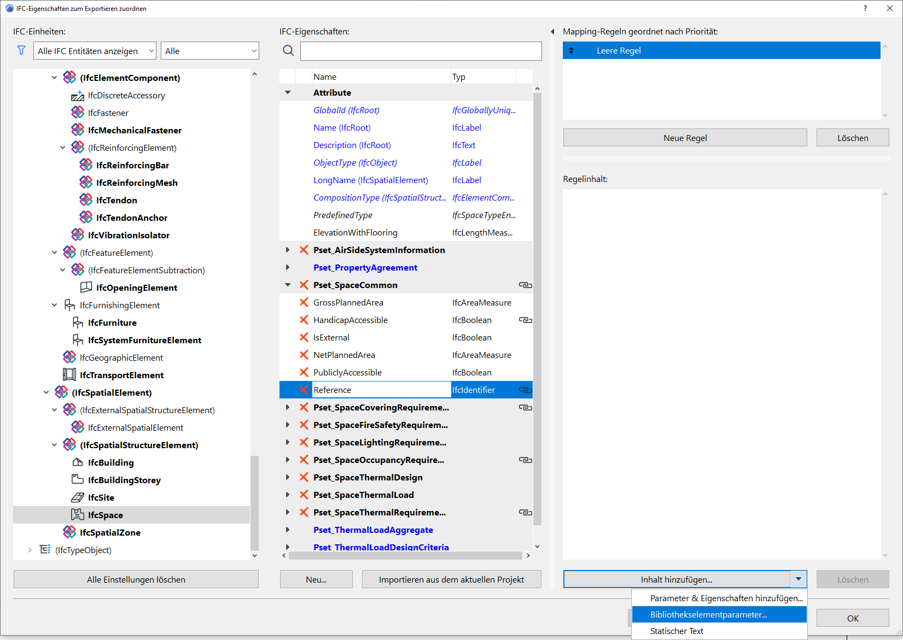
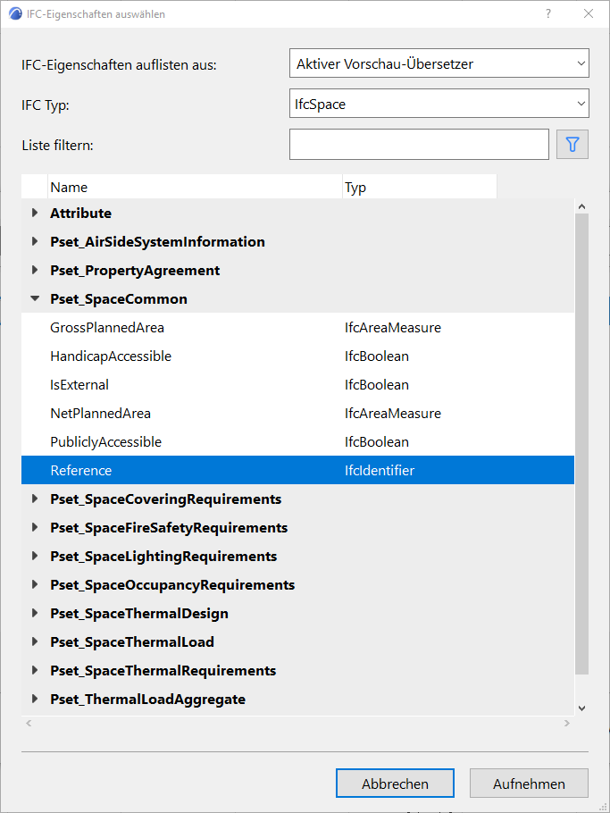

# Gesammelte Tipps und Tricks

### Autotexte verwenden
Archicad verwendet das Konzept von sogenannten Autotexten, das sind Schlüsselwörter in eckigen Klammern (ala `<AUTOTEXT>`). Archicad wertet diese aus und ersetzt dann an dieser Stelle diesen Text durch den entsprechenden hinterlegten Text.  
Diese Autotexte funktionieren auch in GDL Objekten und selbst in im Quelltext davon.  
Eine Auflistung aller möglichen Autotexte im [Helpcenter](https://helpcenter.graphisoft.de/handbuecher/handbucher-zu-archicad-22/hilfe-zu-archicad-22/dokumentation/bema-ung-und-beschriftung/auto-text/auto-text-kurzbeschreibung/). Die Autotexte lassen sich auch beim [Umbenennen](https://helpcenter.graphisoft.de/handbuecher/handbucher-zu-archicad-22/hilfe-zu-archicad-22/dokumentation/publizieren/publisher/) von Publisher-Elementen verwenden; einige spezielle Autotexte sind dort direkt verfügbar, alle anderen können aber trotzdem eingegeben werden.

### Alte Dateien öffnen
Archicad macht einen großartigen Job, was die Kompatibilität der Dateien über viele Versionen hinweg angeht.  
Neuere Archicadversionen können alles herunter bis zur Version 10 (2006) lesen. Um ältere Dateien zu öffnen braucht man einen [File Converter](https://www.graphisoft.com/downloads/fileconverter.html?_ga=2.61625003.643702453.1581271053-1232179466.1527696442). Damit können dann sogar Dateien bis herunter zur Version 4.1 (1992) konvertiert werden. Für noch antikere Versionen kann man sich an den Support wenden.

### Favoriten
Sind mal wieder Einstellungen und Attribute von einem Element auf ein anderes zu übertragen, so geht das fix mit Pipette und Spritze. Was aber, wenn man nicht das nicht für ein oder zwei Objekte macht, sondern für 300? Der Trick ist, sich einen temporären _Favoriten_ zu erstellen, den man nach dem anwenden auf alle Elemente wieder löschen kann.

### Kollisionserkennung
Die Kollisionserkennung in Archicad kann helfen frühzeitig und automatisch Problemen auf die Spur zu kommen. Dabei gibt es jedoch folgendes zu beachten: Archicad kann nicht wissen, bei welchen Verschneidungen es sich um gewollte oder ungewollte handelt. Da weiterhin "stärkere" Baustoffe durch "schwächere" schneiden, werden diese Stellen [nicht erkannt](https://archicad-talk.graphisoft.com/viewtopic.php?f=20&t=69024). Es kann helfen, vor der Kollisionserkennung die Ebenenverschneidungszahl der zu untersuchenden Elemente auf `0` zu stellen.


### Letzten Befehl wiederholen
Wer viel mit anderen CAD-Systemen arbeitet, vermisst vielleicht die Möglichkeit den _letzten Befehl_ zu wiederholen. Tatsächlich bietet sich auch in Archicad diese Möglichkeit. Man kann dem gleichnamigen Befehl einen Keyboardshortcut zuweisen. 


### Linienzeichnung auch im 3D
Wir alle wissen, dass 2D Linien nie im 3D zu sehen sind. Als Alternative bieten sich Morphlinien an, allerdings ist es zu aufwendig eine schon vorhandene Zeichnung damit nachzuzeichnen. Stattdessen kann man die Zeichnung als DWG abspeichern und dann über <samp>'Datei > Interoperabilität > Dazuladen'</samp> mit der Option <samp>'Inhalt des Modellbereichs als GDL Objekt importieren'</samp> re-importieren. Nun ist die Zeichnung auch im 3D sichtbar.


### Element ID Manager
Die Einstellungen des _Element ID Managers_ (gut versteckt unter "<samp>Dokumentation > Listen & Berechnungen > ~</samp>) können gespeichert werden und auf anderen Rechnern wiederverwendet werden: [<sup>Quelle</sup>](https://archicad-talk.graphisoft.com/viewtopic.php?f=34&t=69156)  
Beim Speichern der Einstellungen <samp>Set bearbeiten > Speichern als…</samp> wird ein Ordner namens <samp>EIDM Einstellungen ACVersionnr.Buildnr</samp> innerhalb von
```
C:\Users\<UserProfileName>\AppData\Roaming\GRAPHISOFT   #win
~/Library/Preferences/GRAPHISOFT/                       #mac
```
erzeugt. Die Datei `EIDM Einstellungen.bin` da drin einfach kopieren und auf einen anderen Rechner in den entsprechenden Ordner übertragen.


### Nach Elementparametern suchen
Im Gegensatz zu der Interaktiven Auswertung kann bei <samp>Suchen & Aktivieren</samp> nicht nach Bibliothekselementparametern gesucht werden. Es gibt jedoch einen Umweg über die IFC Sachmerkmale. Im folgenden am Beispiel der Einheitennummer von Räumen illustriert.

Zunächst müssen wir über <samp>Ablage > Interoperabilität > IFC</samp> den <samp>IFC Übersetzer</samp> öffnen. Dort wählen wir den "Allgemeinen Übersetzer" (markiert mit Archicadlogo) aus, legen ihn als Vorschau fest (falls nicht ohnehin ausgewählt) und gehen dann rechts über die drei Punkte zur Eigenschaftenzuordnung.   
Anschließend <samp>IFC-Eigenschaften zuordnen zum Export…</samp>.  


In unserem Beispiel navigieren wir im IFC-Tree zu <samp>IfcSpace</samp>. Im Property Set <samp>SpaceCommon</samp> gibt es bereits einen IfcIdentifier namens `Reference`, den wir für unseren Zweck verwenden können. Natürlich ließe sich auch eine neue IFC–Eigenschaft anlegen. Rechts erstellen wir zunächst eine neue Mapping-Regel, welcher wir über das Dreieck den gewünschen <samp>Bibliothekselementparameter</samp> zuweisen können. Nachdem wir das entsprechende Objekt (hier `Raumstempel DIN xx.gsm`) lokalisiert haben, fügen wir den entsprechenden Parameter `stApartmentId` hinzu. Alles mit OK bestätigen.  
  


Nun lässt sich bei <samp>Suchen & Aktivieren</samp> unter <samp>IFC-Eigenschaften</samp> nach der Einheitennummer suchen.  



### Offscreen Paletten
Besonders wenn man mit Laptop + einem externen Bildschirm arbeitet, kann es passieren, dass unterwegs (ohne zweiten Bildschirm) manche Paletten zu fehlen scheinen und sich auch nicht "wiederbeleben" lassen.  
Eine Lösung dafür ist [hier dokumentiert](https://lucasbecker.de/posts/how-to-get-back-missing-archicad-palettes).  
Tipp: Für solche Umstände zwei Arbeitsumgebungen pflegen!


### Rien ne va plus
Nichts geht mehr? Um Archicad komplett zurückzusetzen ist ein Registry Cleaner auf Nachfrage beim Support erhältlich.
