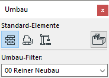

# Der Umbaufilter

## Darstellung
Um transparente Abbruchdarstellungen in den Schnitten/Ansichten zu erreichen, gibt es folgenden Workaround:

1. "Transparenz" in den "Ansichts-Einstellungen" aktivieren
1. Damit nun nicht alle Elemente hinter den Fenstern angezeigt werden die "Durchlässigkeit" des Fensterglasmaterials auf `49` stellen – dies gilt in der Ansichtsdarstellung als nicht transparent und wird opak dargestellt.
1. Ein gelbes Abbruchmaterial mit einem sehr hohen Transparenzfaktor (sprich `> 50`) erstellen.
1. In den Umbau-Überschreibungsstilen der Grafischen Überschreibung bei Abbruch die "Oberfläche" mit dem neuen Abbruchmaterial überschreiben

Wenn jetzt die Abbruchelemente in der Ansicht/im Schnitt überschrieben werden, sieht man gelbe Linien und transparente 3D Elemente mit den dahinterliegenden Neubauelementen.

## Varianten
Der Umbaufilter lässt sich als Variantentool missbrauchen. Zwar gibt es nur drei Status: "Bestand", "Abbruch", und "Neubau", allerdings lassen sich beliebig viele Filter erstellen. In Verbindung mit der Funktion <samp>Nur auf aktuellem Umbaufilter zeigen</samp> (das ist der Button rechts) verfügt man über ein einfaches Variantentool.  
  
Der Nachteil ist so natürlich, dass wenig Übersicht herrscht, besonders bei sehr vielen Varianten. Modellelemente gehen dann gerne mal "verloren". Weiterhin ist der Option recht restriktiv. Braucht man bestimmte Elemente zwar mehrfach, aber nicht überall, muss man sie doppelt zeichnen. Das artet gern in Chaos aus. Man sollte von der Verwendung im Teamwork eher absehen.
