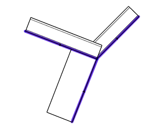
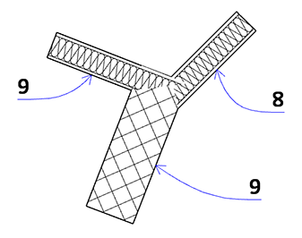
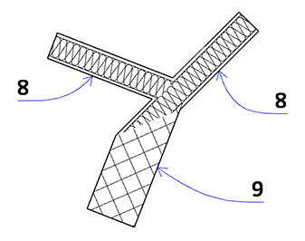
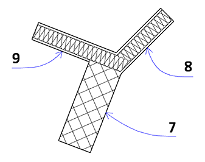

# Wände

Für Wand-Wand-Verbindungen reicht es nicht aus, dass sich die Wände berühren. Ihre Referenzlinien müssen sich schneiden bzw. treffen. Das Element bzw. die Schicht mit dem Baustoff der höheren Priorität schneidet das Element mit der niedrigeren Priorität.

## Anschlussreihenfolge
Die Anschlussreihenfolge ist ein Feature, dass wenig Aufmerksamkeit genießt, zumal es ein etwas abgeschiedenes Dasein fristet:

Jedoch lassen sich damit T/Y- und K-Verbindungen von Wänden meistens auflösen, ohne dass der ["Murray"](/techniken#stützen-zur-verschneidung) zum Einsatz kommen muss. Nun eine kleine Beispielsübersicht mit einer Stahlbetonwand und zwei GK-Wänden, die einem `Y` zusammentreffen. Etikettiert ist die jeweils gesetzte Anschlussreihenfolgenzahl.

Die Lage der blauen Referenzlinien: (Reinzeichnungsmodus ist _aus_, extra farbig hervorgehoben)

(Wenn alle drei Wände die selbe Anschlussreihenfolge haben, sieht das Bild übrigens gleich aus.)

## Bossen & Rustizierungen
Für Bossenmauerwerk und andere, ähnliche Steinmauerwerksapplikationen lässt sich die _Fassade_ einsetzen. Das funktioniert auch für einfachere Fälle, in denen man z.B. Nuten zeigen will (auch wenn dies über [kleine Stützen und Träger](/techniken/#schneidende-luft) genauso möglich ist).  
Im einfachsten Fall lässt man dabei die Profile leer und verwendet nur Panele, für speziellere Fälle kann man in die Fassadenprofile ein Profil aus dem Profilmanager laden. Eine genaue Beschreibung mit etlichen Beispielen findet sich [hier](https://hey-archicad.de/2019/05/29/steinmauerwerk-bossenmauerwerk/).  
Eine Alternative ist der Einsatz des _Wandzubehörs_, oder die Verwendung des _Trussmakers_. Bei dieser zieht man den Truss mittels _SEO_ von der Wand ab.

## Wand-Listenparameter
Der [Help Center Artikel](https://helpcenter.graphisoft.de/handbuecher/handbucher-zu-archicad-23/hilfe-zu-archicad-23/elementparameter/wand-listenparameter/) hat eine Zusammenstellung.